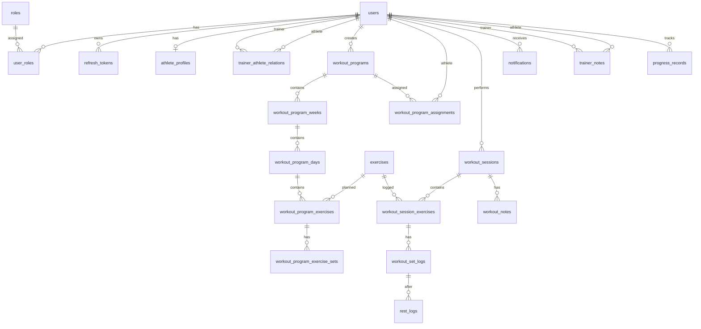

# Database ERD

## Notes

- `users` stores all account identities.
- Trainer and athlete behavior is controlled by roles.
- Athlete-specific fields are stored in `athlete_profiles`.
- Trainer-athlete access is controlled by `trainer_athlete_relations`.
- Workout program data stores planned training.
- Workout session data stores actual performed training.
