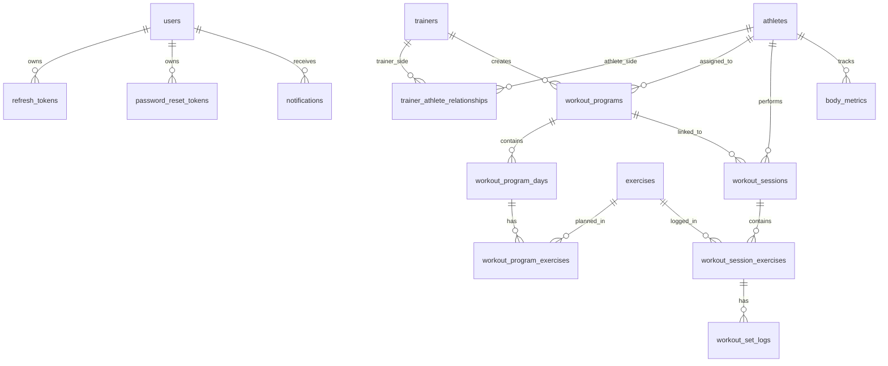

# Database ERD

Current active entity relationships. Dead tables (program_templates, training_classes, template_purchases, user_integrations) are omitted.



## Table Summary

| Table                         | Description                                                  |
|-------------------------------|--------------------------------------------------------------|
| users                         | All account identities (Admin / Trainer / Athlete JWT role)  |
| refresh_tokens                | Rolling refresh token hashes                                 |
| password_reset_tokens         | Single-use password reset token hashes                       |
| trainers                      | Trainer profile entities (linked to users by email)          |
| athletes                      | Athlete profile entities (linked to users by email)          |
| trainer_athlete_relationships | Coaching access grants (Pending / Accepted / Rejected)       |
| exercises                     | Exercise library (global seeded + user-private)              |
| workout_programs              | Training programs per athlete (trainer-led or self-guided)   |
| workout_program_days          | Days within a program                                        |
| workout_program_exercises     | Planned exercise entries per day                             |
| workout_sessions              | Actual workout session records (InProgress or Completed)     |
| workout_session_exercises     | Exercises tracked within a session (with plan snapshot)      |
| workout_set_logs              | Individual set records (reps, weight, RPE)                   |
| body_metrics                  | Physical measurement records per athlete (9 fields)          |
| notifications                 | In-app notifications triggered by system events              |

## Key Foreign Key Relationships

```
users.id ←── refresh_tokens.user_id
users.id ←── password_reset_tokens.user_id
users.id ←── notifications.user_id
users.id ←── exercises.owner_id  (null = global)

trainers.id ←── trainer_athlete_relationships.trainer_id
athletes.id ←── trainer_athlete_relationships.athlete_id
trainers.id ←── workout_programs.trainer_id  (null = self-guided)
athletes.id ←── workout_programs.athlete_id

workout_programs.id ←── workout_program_days.program_id
workout_program_days.id ←── workout_program_exercises.day_id
exercises.id ←── workout_program_exercises.exercise_id  (restrict)

athletes.id ←── workout_sessions.athlete_id
workout_programs.id ←── workout_sessions.program_id  (null if manual)
workout_sessions.id ←── workout_session_exercises.session_id
exercises.id ←── workout_session_exercises.exercise_id  (restrict)
workout_session_exercises.id ←── workout_set_logs.session_exercise_id

athletes.id ←── body_metrics.athlete_id
```

## Notes

- `users` and `trainers`/`athletes` are linked by matching `email` field, not by a direct FK. This supports the dual-role pattern where one person can have both a trainer entity and an athlete entity.
- `workout_programs.trainer_id` is nullable: null means the athlete created a self-guided program.
- `exercises.owner_id` is nullable: null means the exercise is global (seeded by `ExerciseSeeder`).
- `workout_session_exercises` stores a snapshot of planned values (`planned_sets`, `planned_reps`, etc.) copied from the program day exercise at session start so changes to the plan do not retroactively affect session history.
