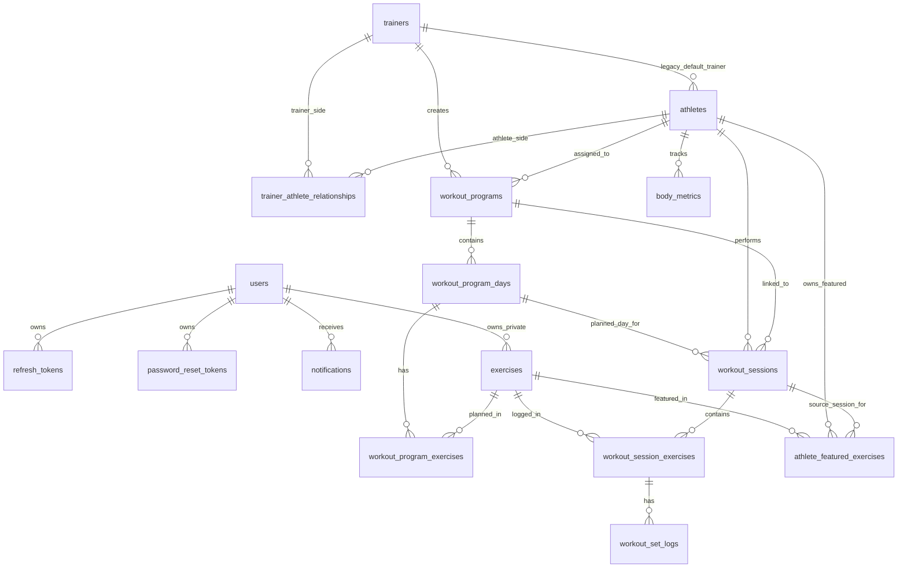

# Database ERD

Current active entity relationships. Inactive schema tables are intentionally omitted from this diagram.



## Table Summary

| Table | Description |
|-------|-------------|
| users | Account identities and JWT role source |
| refresh_tokens | Rolling refresh token hashes |
| password_reset_tokens | Single-use password reset token hashes |
| notifications | In-app notifications |
| trainers | Trainer profile entities linked to users by email |
| athletes | Athlete profile entities linked to users by email |
| athlete_featured_exercises | Athlete profile showcase exercises, optionally tied to a source session |
| trainer_athlete_relationships | Coaching access grants |
| exercises | Global and private exercise library |
| workout_programs | Trainer-led or self-guided programs |
| workout_program_days | Planned days in a program, with optional rescheduled date |
| workout_program_exercises | Planned exercises per program day |
| workout_sessions | Actual workout sessions, optionally linked to a program and day |
| workout_session_exercises | Exercises tracked inside a session |
| workout_set_logs | Set-level workout logs |
| body_metrics | Physical measurement records per athlete |

## Key Foreign Keys

```text
users.id <- refresh_tokens.user_id
users.id <- password_reset_tokens.user_id
users.id <- notifications.user_id
users.id <- exercises.owner_id

trainers.id <- athletes.trainer_id
trainers.id <- trainer_athlete_relationships.trainer_id
athletes.id <- trainer_athlete_relationships.athlete_id

trainers.id <- workout_programs.trainer_id
athletes.id <- workout_programs.athlete_id
workout_programs.id <- workout_program_days.program_id
workout_program_days.id <- workout_program_exercises.day_id

athletes.id <- workout_sessions.athlete_id
workout_programs.id <- workout_sessions.program_id
workout_program_days.id <- workout_sessions.program_day_id

workout_sessions.id <- workout_session_exercises.session_id
exercises.id <- workout_program_exercises.exercise_id
exercises.id <- workout_session_exercises.exercise_id
workout_session_exercises.id <- workout_set_logs.session_exercise_id

athletes.id <- athlete_featured_exercises.athlete_id
exercises.id <- athlete_featured_exercises.exercise_id
workout_sessions.id <- athlete_featured_exercises.session_id
athletes.id <- body_metrics.athlete_id
```

## Notes

- `users` and `trainers`/`athletes` are linked by matching email, not a direct foreign key.
- `users` stores shared profile fields (`age`, `profession`, `training_years`, `primary_sport` as a normalized comma-separated sports list, and `sports_json` for per-sport experience years) plus `read_notification_retention_days`, which only controls the Web topbar dropdown.
- `workout_programs.trainer_id` is nullable; null means self-guided.
- `workout_programs.is_active = false` marks trainer-created programs as passive after a trainer-athlete relationship is ended. Passive programs remain visible/read-only and are reactivated if the same relationship is accepted again.
- `workout_sessions.program_id` and `workout_sessions.program_day_id` are nullable so session history survives program/day deletion.
- `exercises.owner_id` is nullable; null means the exercise is seeded/global.
- `workout_session_exercises` stores planned value snapshots so future program edits do not rewrite training history.
