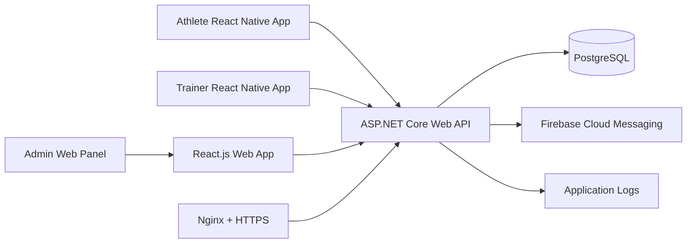

# System Architecture

TrackMe uses a modular client-server architecture.

## High-Level Components

- React Native mobile app
- React.js web app
- ASP.NET Core Web API
- PostgreSQL database
- Firebase Cloud Messaging for push notifications
- Docker runtime on VPS
- Nginx reverse proxy
- HTTPS termination

## Context Diagram

## Architecture Goals

- Keep business logic in backend services.
- Keep mobile UI fast and focused.
- Keep web UI clean for admin, trainer, and management workflows.
- Keep database relational and analytics-friendly.
- Keep modules isolated by responsibility.
- Use clear authorization boundaries.
- Make future admin panel and integrations possible.

## Main Backend Modules

- Auth Module
- User Module
- Trainer Module
- Athlete Module
- Relationship Module
- Exercise Module
- Workout Program Module
- Workout Tracking Module
- RPE Module
- Notification Module
- Analytics Module
- Admin Module

## Request Flow

1. Mobile app sends authenticated request with JWT.
2. API validates token, role, and ownership.
3. Controller maps request to application service.
4. Service validates business rules.
5. Repository or DbContext persists relational data.
6. Domain events may trigger notifications or analytics updates.
7. API returns response DTO.

## Suggested Backend Layering

- API Layer: controllers, endpoint filters, request models
- Application Layer: use cases, services, validators
- Domain Layer: entities, enums, business rules
- Infrastructure Layer: database, notifications, logging, external services

## Cross-Cutting Concerns

- Authentication
- Authorization
- Input validation
- Exception handling
- Logging
- Auditing
- Rate limiting
- Pagination
- Data ownership checks
